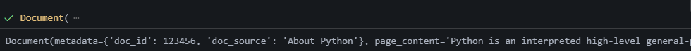
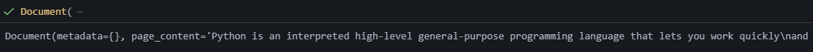

# Documents

A `Document` object in `LangChain` contains information about some data. A Document object has the following two attributes.

- `page_content` :  `str`  : This attribute holds the content of the document
- `metadata` : `dict` :  This attribute contains arbitrary metadata associated with the document. You can use the metadata to track various details, such as the document ID, the file name, and other details.

**NOTE :** You don't have to include metadata.

