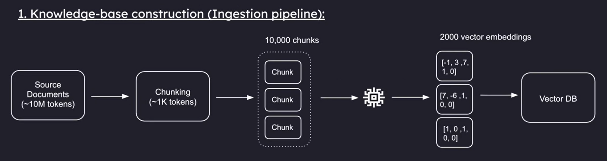
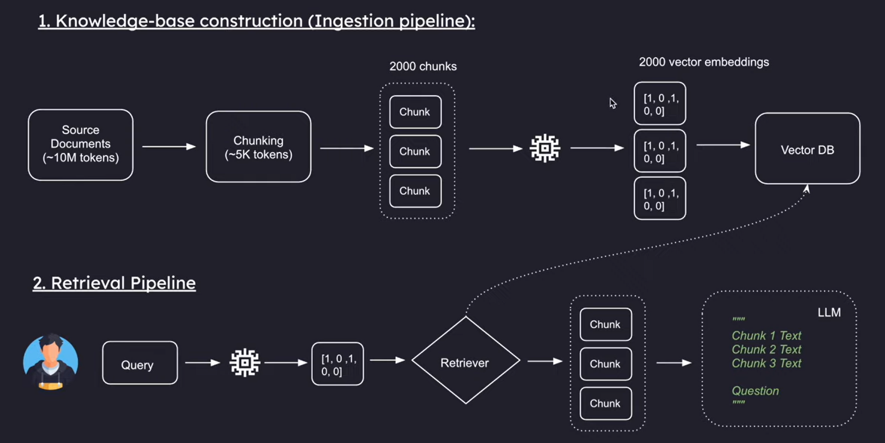

# Retrieval Augmented Generation (RAG)

---

## 1. Understanding Tokens

In the context of Large Language Models (LLMs), a **token** is the fundamental unit of text that the model processes.

### What is a Token?

A token can be as short as a single character or as long as one word. It depends on the language and the text's structure.

| Example | Token Breakdown |
|---------|-----------------|
| `hello` | 1 token |
| `I'm` | 2 tokens (`I` + `m`) |

### Why Are Tokens Important?

Tokens are crucial because LLMs have a limit on how many tokens they can process at once. This is known as the **context window**.

> **Context Window Limitation:**
>
> If a model has a context window of 8,000 tokens, and you send a 7,500-token document with a 500-token question, you're at the limit. The model has no room to generate a meaningful response.

This limitation means you cannot feed an entire, very large document (e.g., a PDF with 10 million tokens) to the model in a single request. **This is one of the core problems that RAG solves.**

---

## 2. Embeddings and Vector Databases

To make text understandable for a computer, we convert it into a mathematical representation called a **vector embedding**.

### What Are Embeddings?

A vector embedding is a list (or array) of numbers that represents a word, sentence, or even an image. Each number in this list is called a **dimension**.

For example, the word `cat` might be represented by the vector: [34, 21, 7.5]

In this representation, each number can capture a certain aspect of the word's meaning, such as "smallness" or "furryness."

### How Embeddings Work

Words with similar semantic meanings have vectors that are mathematically closer to each other in a multi-dimensional space.

| Word | Vector | Relationship |
|------|--------|--------------|
| Cat | `[34, 8, 7.5]` | — |
| Kitten | `[33, 8, 2]` | Close to cat |
| Dog | `[22, 8, 2]` | Relatively close to cat and kitten |
| Elephant | `[2, 62, 2]` | Far from cat |

### Real-World Embeddings

While the examples show only 3 dimensions, modern embedding models like OpenAI's `text-embedding-3-large` can generate vectors with up to **3,072 dimensions**.

| Aspect | Detail |
|--------|--------|
| **Key Point** | Whether you embed a single word like "cat" or an entire paragraph, the output is always **one vector** of that fixed dimension size |
| **Advantage** | Higher-dimensional embeddings capture more nuanced semantic information |
| **Disadvantage** | They are more expensive to compute and require more storage space |

### Consistency Is Key

You **MUST** use the exact same embedding model for both your documents (during knowledge base construction) and your user queries (during retrieval).

> **Important:** Think of embeddings like languages. If you embed your documents with `text-embedding-3-small` and a user query with `text-embedding-3-large`, they "can't understand each other."

Even within the same model, the dimensionality must be identical. If your documents are embedded with `text-embedding-3-large` at 1536 dimensions, your user queries must also be embedded with the same model at exactly 1536 dimensions.

---

## 3. The RAG System Architecture

A RAG system is typically built in two main phases: the ingestion pipeline and the retrieval pipeline.

### Phase 1: Knowledge-Base Construction (Ingestion Pipeline)

This is the process of preparing your external knowledge base for retrieval.

| Step | Description |
|------|-------------|
| **Source Documents** | Start with your source material (e.g., a PDF with ~10 million tokens) |
| **Chunking** | Split the source documents into smaller, manageable pieces called chunks |
| **Embedding** | Each text chunk is passed through an embedding model to generate a unique vector embedding |
| **Storage in Vector DB** | These vector embeddings, along with references to their original text chunks, are stored in a specialized Vector Database optimized for similarity search |

### Phase 2: Retrieval Pipeline (Query Time)

This is the process of augmenting a user's prompt with relevant context from the knowledge base.

| Step | Description |
|------|-------------|
| **User Query** | A user asks a question (e.g., "What is the main topic of the document?") |
| **Embed the Query** | The **same embedding model** used in Phase 1 converts the user's query into a vector embedding |
| **Retrieve Relevant Chunks** | The Vector DB performs similarity search to find vectors closest to the query vector |
| **Augment the Prompt** | Retrieved text chunks are combined with the original user question |
| **Generate Response** | The augmented prompt is sent to the LLM for an accurate, context-aware answer |

---

## 4. Key Relationships Summary

| Relationship | Explanation |
|--------------|-------------|
| **Tokens → Context Window** | The context window is a limit on tokens. You cannot exceed this total token count in a single LLM call. |
| **Tokens → Chunks** | You split large token counts into smaller chunks. Each chunk's token size is chosen to be manageable within the context window when combined with other chunks and the query. |
| **Chunks → Embeddings** | Each chunk becomes **one vector embedding**, regardless of how many tokens it contains. This compression is what enables efficient search. |
| **Embeddings → Retrieval** | Embeddings allow semantic search. You find chunks by mathematical proximity, not by keyword matching. |
| **Retrieval → Context Window** | The retrieval step ensures you only pull back enough chunks to fill (but not exceed) the context window, solving the original limitation. |

---

## 5. One Chunk = One Vector Embedding

A critical concept to understand: **there is no 1:1 relationship between tokens and vectors.** Instead, **one chunk of text produces exactly one vector embedding.**

Think of an embedding as a **compressed semantic summary** of the entire chunk:

| Input | Output |
|-------|--------|
| 5,000 tokens of text | 1 vector (e.g., 1,536 numbers) |
| `"The cat sat on the mat..."` | `[0.23, -0.45, 0.89, ...]` |

### What the Embedding Captures

The embedding model "reads" the entire chunk and compresses its meaning into a fixed-size vector. This vector captures:

- The topics discussed
- The overall sentiment
- Key concepts and their relationships
- The semantic essence of the content

---

## 6. Chunking and Embedding Strategy Guide

### Use Case Strategy Matrix

| Use Case | Chunking Priority | Embedding Priority |
|----------|-------------------|-------------------|
| **Factual Q&A** | Small chunks, high precision | High accuracy model |
| **Document Summarization** | Large chunks, semantic boundaries | Good semantic capture |
| **Code Assistance** | Function/class boundaries | Code-specialized model |
| **Conversational AI** | Overlapping chunks | Conversational data training |
| **Multi-language** | Language-agnostic splitting | Multilingual model |

### Chunk Size Guidelines

| Size Range | Best For |
|------------|----------|
| **128-512 tokens** | Factual Q&A, specific details, code snippets |
| **512-1,500 tokens** | General RAG applications, documentation Q&A (recommended starting point) |
| **1,500-5,000 tokens** | Summarization, narrative content, academic papers |

### Embedding Model Considerations

| Factor | What to Consider |
|--------|------------------|
| **Model Size** | Small (384-768 dim) → Faster, cheaper, less nuance |
| | Medium (1,024-1,536 dim) → Good balance (industry standard) |
| | Large (3,072+ dim) → Maximum accuracy, higher cost |
| **Language** | Ensure the model supports your target languages |
| **Domain** | Consider specialized models for code, medical, legal content |
| **Max Tokens** | Check model's input limit; don't exceed it |

---

## 7. Common Pitfalls to Avoid

| Pitfall | Why It's a Problem | How to Avoid |
|---------|-------------------|--------------|
| **Splitting mid-sentence** | Breaks semantic meaning; retrieval finds half-thoughts | Use semantic chunking; ensure boundaries at punctuation |
| **Inconsistent chunk sizes** | Some chunks too small (no signal), others too large (fuzzy) | Use consistent strategy; set min/max limits |
| **Forgetting metadata** | Can't filter or cite sources | Preserve source, page, section with each chunk |
| **Mixing embedding models** | Retrieval fails; vectors are incomparable | Use exactly the same model for everything |
| **Ignoring model limits** | Chunks exceeding max tokens fail to embed | Check model's max tokens; enforce chunk size limit |
| **Not evaluating** | No way to know if your choices work | Always test with representative queries |

---

## Quick Reference

### Recommended Starting Point

If you're building a new RAG system and need a place to start:

| Parameter | Recommended Starting Point |
|-----------|---------------------------|
| **Chunk size** | 512-1,024 tokens |
| **Chunk strategy** | Recursive (semantic boundaries first) |
| **Overlap** | 10-20% of chunk size |
| **Embedding model (API)** | OpenAI `text-embedding-3-small` (1,536 dim) |
| **Embedding model (Open Source)** | `BAAI/bge-large-en` (1,024 dim) |

### Key Takeaways

1. **Tokens** are the fundamental unit of text; context windows limit how many tokens an LLM can process
2. **Embeddings** compress text into mathematical vectors that capture semantic meaning
3. **One chunk = one vector** — not one vector per token
4. **Consistency is critical** — always use the same embedding model for documents and queries
5. **Chunking strategy** significantly impacts retrieval quality; choose based on your use case
6. **Always evaluate** — test with representative queries before committing to a configuration

