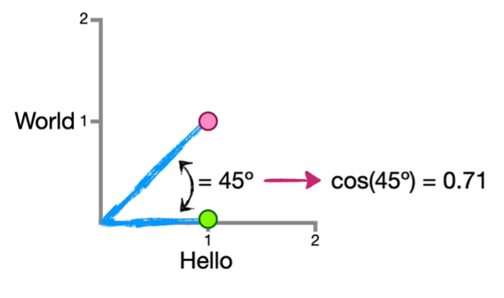

# Understanding Cosine Similarity

Cosine similarity is a metric used to measure how similar two vectors are, regardless of their magnitude. It is widely used in text analysis, machine learning, and information retrieval to compare documents or embeddings.

## The Basics: From Words to Vectors

Imagine we want to compare the similarity of two short phrases. To do this mathematically, we must convert them into vectors. We do this by creating a **term frequency vector** based on the unique words in our corpus.

Let's start with two phrases:
- **Phrase A:** `"hello world"`
- **Phrase B:** `"hello"`

### Word Count Table

| Phrase        | hello | world |
|---------------|-------|-------|
| hello world   | 1     | 1     |
| hello         | 1     | 0     |

This gives us two vectors:
- **A** = (1, 1)
- **B** = (1, 0)

---

Since we only have two words (`hello`, `world`), we can plot these vectors on a 2D graph.

*Figure 1: Vector A (Hello World) and Vector B (Hello) plotted on a 2D plane, forming a 45° angle.*

In the graph above:
- The x-axis represents the count of the word `hello`.
- The y-axis represents the count of the word `world`.
- The angle (θ) between the two lines is 45°.

The cosine similarity for this case is:
$$
\cos(45°) = 0.71
$$

---

## The Effect of Vector Length

Now, let's compare phrase `"hello world"` with phrase `"hello hello hello"`.

- **Phrase A:** `"hello world"` → **A** = (1, 1)
- **Phrase C:** `"hello hello hello"` → **C** = (3, 0)

### Word Count Table

| Phrase              | hello | world |
|---------------------|-------|-------|
| hello world         | 1     | 1     |
| hello hello hello   | 3     | 0     |

*Figure 2: Vector C (Hello Hello Hello) is longer along the X-axis, but the angle relative to A remains 45°.*

**Key Insight:** Even though the length (magnitude) of the vector changed significantly, the **angle** between the vectors remained the same. The cosine similarity is still:
$$
\cos(45°) = 0.71
$$

This illustrates that **cosine similarity is determined entirely by the angle between the lines, not by the lengths of the lines.**

---

## Extreme Cases: Same Direction vs. Perpendicular

To solidify the concept, let's look at perfect similarity and perfect dissimilarity.

### Case 1: Identical Phrases
- **Phrase A:** `"hello world"` → (1, 1)
- **Phrase D:** `"hello world"` → (1, 1)

The angle between identical vectors is **0°**.

*Figure 3: Identical vectors lie on top of each other, angle = 0°.*

- **Cosine Similarity:** 
  $$
  \cos(0°) = 1
  $$
- **Interpretation:** Perfect similarity.

### Case 2: No Shared Words
- **Phrase A:** `"hello"` → (1, 0)
- **Phrase E:** `"world"` → (0, 1)

The angle between these vectors is **90°**.

*Figure 4: Vectors with no shared words are orthogonal, angle = 90°.*

- **Cosine Similarity:** 
  $$
  \cos(90°) = 0
  $$
- **Interpretation:** No similarity (orthogonal).

---

## The Formula and High Dimensions

In the examples above, we were able to plot the vectors because we only had 2 dimensions (2 words). In reality, a document might contain thousands of unique words (n-dimensions). We cannot visualize n-dimensional space, so we rely on the mathematical formula.

The Cosine Similarity formula is:

$$
\text{Cosine Similarity} = \frac{\sum_{i=1}^{n} A_i B_i}{\sqrt{\sum_{i=1}^{n} A_i^2} \cdot \sqrt{\sum_{i=1}^{n} B_i^2}}
$$

Where:
- \( n \) is the number of unique words in the combined vocabulary.
- \( Ai \) is the count (or weight) of word \( i \) in document A.
- \( Bi \) is the count (or weight) of word \( i \) in document B.

### Step-by-Step Calculation

Let’s calculate the cosine similarity between **A = "hello world"** and **B = "hello"** using the formula.

**Step 1: Determine the Vocabulary (n=2)**
1. `hello` (i=1)
2. `world` (i=2)

**Step 2: Create the Vectors**
- A = ( \(A1\), \(A2\) ) = (1, 1)
- B = ( \(B1\), \(B2\) ) = (1, 0)

**Step 3: Calculate the Numerator (Dot Product)**
$$
\sum_{i=1}^{n} A_i B_i = (A_1 \cdot B_1) + (A_2 \cdot B_2) = (1 \cdot 1) + (1 \cdot 0) = 1 + 0 = 1
$$

**Step 4: Calculate the Denominator (Product of Magnitudes)**
$$
\sqrt{\sum_{i=1}^{n} A_i^2} = \sqrt{(1)^2 + (1)^2} = \sqrt{1 + 1} = \sqrt{2}
$$
$$
\sqrt{\sum_{i=1}^{n} B_i^2} = \sqrt{(1)^2 + (0)^2} = \sqrt{1 + 0} = 1
$$
$$
\text{Product} = \sqrt{2} \cdot 1 = \sqrt{2}
$$

**Step 5: Final Calculation**
$$
\text{Cosine Similarity} = \frac{1}{\sqrt{2}} \approx 0.707
$$

---

## Modern Embeddings: Simplifying the Formula

In traditional methods (like the example above), vectors represented raw counts. In modern Machine Learning, we use **embeddings** (e.g., Word2Vec, BERT). These embeddings are often **normalized** to have a magnitude of 1, which greatly simplifies the cosine similarity calculation.

### What Does "Normalized" Mean?

A vector is **normalized** when you divide it by its own magnitude, resulting in a vector of length exactly 1. This new vector points in the same direction as the original but is scaled to lie on the **unit circle** (or unit sphere in higher dimensions). It is often called a **unit vector**.

Mathematically, for a vector **A**, its normalized form \($\hat{A}$\) is given by:
$$
\hat{\mathbf{A}} = \frac{\mathbf{A}}{\|\mathbf{A}\|}
$$

**Example:**
Take \(A = (3, 4)\). Its magnitude is:
$$
\|\mathbf{A}\| = \sqrt{3^2 + 4^2} = \sqrt{9 + 16} = 5
$$
The normalized vector is:
$$
\hat{\mathbf{A}} = \left( \frac{3}{5}, \frac{4}{5} \right) = (0.6, 0.8)
$$
Check its magnitude:
$$
\sqrt{0.6^2 + 0.8^2} = \sqrt{0.36 + 0.64} = \sqrt{1} = 1
$$
So \($\hat{A}$\) lies exactly on the unit circle, preserving the original direction but with length 1.

### Why Normalize?

When both vectors are normalized, their magnitudes are both 1. Plugging into the cosine similarity formula:
$$
\text{Cosine Similarity} = \frac{\sum A_i B_i}{1 \cdot 1} = \sum A_i B_i
$$
That is, **cosine similarity equals the dot product**. This is computationally faster and numerically stable, which is why modern embedding libraries (like those from OpenAI, Cohere, or Hugging Face) often return normalized embeddings by default.

Thus, when working with such embeddings, you can compute similarity simply as the dot product:
$$
\text{Similarity} = \mathbf{A} \cdot \mathbf{B} = \sum_{i=1}^{n} A_i B_i
$$

---

## Summary

- Cosine similarity measures the angle between two vectors, ignoring their magnitudes.
- In 2D, we can visualize the vectors and the angle.
- In high-dimensional spaces, we use the formula that involves dot products and magnitudes.
- When vectors are normalized to length 1, cosine similarity simplifies to the dot product.
- This simplification is used extensively in modern AI systems for fast and efficient similarity calculations.